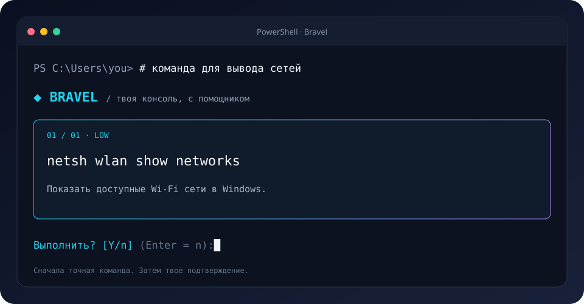

<div align="center">

# ◆ Bravel

### Твоя консоль. Теперь с ИИ.

Надстройка для **PowerShell** и **Bash**, которая превращает мысли в команды.

[](https://github.com/coylll-dev/Bravel/actions/workflows/tests.yml)


[](LICENSE)



**Напиши задачу → посмотри команду → подтверди запуск.**

</div>

```powershell
# команда для вывода сетей
# открой мне кс
# найди самые большие файлы в этой папке, без удаления
```

Bravel работает внутри привычной оболочки. `cd`, pipes, aliases, completion и обычные команды остаются её задачей. Отдельного shell здесь нет.

## Возможности

| Возможность | Как работает |
| --- | --- |
| `# запрос` | Строка отправляется ИИ, который предлагает команды для вашей ОС |
| `cdm → cmd` | Неизвестная команда вызывает подсказку; простые опечатки исправляются без API |
| Объяснения | Каждый шаг показывает точную команду, назначение и оценку риска |
| Подтверждение | `Y` разрешает план; Enter и `n` отменяют; повышенный риск требует `RUN` |
| Игры Steam | CS2, Deep Rock Galactic и другие установленные игры по полному названию |
| Просмотр | `--dry-run` показывает план без выполнения |
| Gemini и роутеры | Прямой Gemini API, OpenAI, OpenRouter и другие совместимые сервисы |
| Установка и удаление | Python-установщик; `bravel update` и `bravel uninstall` |
| Красивый терминал | Закрытые рамки, цветные панели, `NO_COLOR` и монохромный режим |
| Диалог с агентом | История, анализ вывода, следующие шаги и остановка через Ctrl+C |

## Диалог с агентом

```text
bravel chat
```

Можно запускать из CMD, PowerShell или Bash. На Windows агент по умолчанию выполняет действия в PowerShell без загрузки профиля; менять политику выполнения не нужно. На Linux используется Bash. Явный выбор: `bravel chat --shell cmd`.

Напишите, например: «Проверь сеть и объясни результат» или «Запусти Deep Rock Galactic». Агент показывает точные команды, ждёт подтверждения, выполняет их и анализирует вывод. Каждому следующему плану нужно новое разрешение. Enter и `n` отменяют, повышенный риск требует `RUN`. Ctrl+C останавливает текущую команду или отменяет запрос; диалог остаётся доступным.

| Команда диалога | Действие |
| --- | --- |
| `/help` | Подсказка |
| `/games` | Найти установленные игры Steam без API |
| `/pwd` | Показать рабочую папку агента |
| `/cd <путь>` | Сменить папку без API, в том числе для CMD |
| `/shell powershell` | Переключить исполнитель на `powershell`, `cmd` или `bash` |
| `/status` | Провайдер, модель, наличие ключа, оболочка и папка |
| `/continue` | Повторно проанализировать последний результат |
| `/history` | Показать текущую историю |
| `/new` | Очистить диалог |
| `/exit` | Выйти |

Можно начинать вопросы с `#`. История хранится в памяти сессии, максимум 12 записей; вывод команды ограничен последними 12 КБ. Эти данные используются в последующих запросах к выбранному API. `/new` очищает историю. Максимум восемь циклов на задачу, 120 секунд и 2 МБ записанного вывода на команду. Смена папки PowerShell/Bash сохраняется между действиями; для CMD используйте `/cd`. Переменные оболочки между отдельными командами не сохраняются.

Для одной задачи с анализом результата:

```text
bravel agent "Проверь сеть и объясни результат"
```

`bravel ask` остаётся режимом одного плана, а `--dry-run` показывает команды без выполнения. Действия на компьютере выполняются через подтверждённые команды. Управление мышью и распознавание экрана не входят в CLI.

## Простая установка

Нужен Python 3.10+. Скачайте [`install.py`](https://raw.githubusercontent.com/coylll-dev/Bravel/main/install.py) и выполните:

```powershell
# Windows
python install.py
```

```bash
# Linux
python3 install.py
```

Git, ручной venv и запуск `.ps1` не нужны. Установщик скачивает пакет, создаёт отдельное окружение без прав администратора, подключает Bravel к профилю оболочки и открывает мастер настройки. Выберите провайдера, модель и введите ключ; ввод ключа скрыт. После установки откройте **PowerShell на Windows** или **Bash на Linux**. Windows Terminal — приложение терминала; вкладка CMD внутри него остаётся CMD.

В PowerShell/Bash выполните `bravel doctor`, затем `ai "покажи сетевые подключения"` или наберите `# команда для вывода сетей` и нажмите Enter. `cdm` вызовет предложение исправления; `Y` подтвердит команду.

### CMD и Windows с запрещёнными скриптами

Прямой CLI работает без профиля и без изменения политики PowerShell. В CMD создайте короткую команду на текущую сессию:

```bat
doskey bravel="%LOCALAPPDATA%\Bravel\venv\Scripts\bravel.exe" $*
bravel doctor
bravel ask --shell cmd "команда для вывода сетей"
bravel fix --shell cmd "cdm"
bravel configure
```

После закрытия CMD повторите `doskey`. Можно всегда использовать полный путь вместо `bravel`. Автоматические `# запросы` и обработка неизвестных команд требуют PowerShell/Bash с загруженным подключением; в CMD вводите `bravel ask` и `bravel fix`. При `Restricted` профиль PowerShell блокируется; установщик сообщит об этом и оставит политику без изменений.

Можно сразу выбрать Gemini: `python install.py --provider gemini`, или OpenRouter: `--provider openrouter`. Без мастера: `--no-configure`; позже запустите `bravel configure`. На Linux без поддержки venv установите пакет `python3-venv` средствами своего дистрибутива.

| Действие | Команда |
| --- | --- |
| Изменить API, модель или ключ | `bravel configure` |
| Переключиться на Gemini | `bravel configure --provider gemini` |
| Обновить программу | `bravel update` |
| Удалить программу и подключение | `bravel uninstall` |
| Удалить также стандартный `.env` с ключом | `bravel uninstall --purge` |

Обновление и удаление завершаются отдельным Python-процессом, чтобы Windows освободила запущенный `bravel.exe`. Дождитесь сообщения о завершении и откройте новый терминал. Удаление сохраняет конфиг API по умолчанию и резервную копию исходного профиля `.bravel.bak`. Пользовательский профиль и чужие окружения не удаляются.

Если команда недоступна, скачанный установщик тоже умеет управление:

```text
python install.py update
python install.py uninstall
```

На Linux используйте `python3`. Каталог установки: `%LOCALAPPDATA%/Bravel` на Windows, `$XDG_DATA_HOME/bravel` или `~/.local/share/bravel` на Linux. Можно выбрать `--prefix`, `--shell`, `--profile`, либо установить только CLI с `--no-profile` и запускать его из `venv/Scripts` или `venv/bin` в каталоге установки.

Windows подключает найденные PowerShell 7 и Windows PowerShell; Linux — Bash. Zsh/fish и автоматические хуки CMD пока не поддерживаются. Внутренние `.ps1` и `.bash` остаются адаптерами для перехвата `#` и неизвестных команд; пользователю подключать их вручную не нужно. Установщик не меняет политики выполнения PowerShell: если система запрещает профили, используйте CLI по полному пути установки, а для автоматического подключения потребуется разрешённый профиль.

Если у вас была версия 0.3.0 с окном C#, закройте её и выполните новый `install.py update`. Установщик удалит прежнее окно и его ярлыки, сохранив CLI и ключ. Версия 0.4.0 распространяется только как Python CLI.

## Ручная установка для разработки · Windows

Нужны Python 3.10+, Git и PowerShell с PSReadLine. Рекомендуется PowerShell 7.

```powershell
git clone https://github.com/coylll-dev/Bravel.git
cd Bravel
python -m venv .venv
.\.venv\Scripts\Activate.ps1
python -m pip install -e .
bravel init
notepad "$HOME\.config\bravel\.env"
```

Заполните `AI_API_KEY`, `AI_MODEL` и при необходимости `AI_API_BASE_URL`. Затем:

```powershell
bravel doctor
. (bravel integration powershell)
```

Теперь прямо в этой консоли:

```powershell
cdm
# команда для вывода сетей
# открой мне кс
ai 'покажи процессы, которые занимают больше всего памяти'
```

Если активация venv ограничена вашей политикой PowerShell, используйте окружение без активации:

```powershell
$env:PATH = "$PWD\.venv\Scripts;$env:PATH"
.\.venv\Scripts\bravel.exe doctor
. (.\.venv\Scripts\bravel.exe integration powershell)
```

Подключение действует только в текущей сессии. Для автоподключения добавьте в `$PROFILE` путь к установленному скрипту `bravel.ps1`; команда `bravel` должна быть доступна в PATH. `bravel integration powershell` выводит нужный путь. Профиль Bravel сам не меняет.

## Ручная установка для разработки · Linux

```bash
git clone https://github.com/coylll-dev/Bravel.git
cd Bravel
python3 -m venv .venv
source .venv/bin/activate
python -m pip install -e .
bravel init
${EDITOR:-nano} "$HOME/.config/bravel/.env"
bravel doctor
source "$(bravel integration bash)"
```

```bash
# команда для вывода сетей
# покажи свободное место на дисках
gti status
ai 'как узнать мой локальный IP'
```

Для постоянного подключения добавьте в `~/.bashrc`:

```bash
# Если bravel установлен в PATH, например через pipx install .
if command -v bravel >/dev/null 2>&1; then
    source "$(bravel integration bash)"
fi
```

## Конфигурация

По умолчанию: `~/.config/bravel/.env` на обеих ОС, на Windows — `%USERPROFILE%\.config\bravel\.env`. Это пользовательский конфиг установленной программы. `.env` в корне исходников не требуется и автоматически не читается; `.env.example` — только шаблон для разработки.

```dotenv
AI_PROVIDER=openai
AI_API_BASE_URL=https://api.openai.com/v1
AI_API_KEY=your-api-key
AI_MODEL=gpt-4o-mini
AI_TIMEOUT=45
AI_JSON_MODE=true
AI_MAX_STEPS=5
AI_REQUIRE_KEY=true
AI_COLOR=auto
```

| Параметр | Значение |
| --- | --- |
| `AI_PROVIDER` | `openai`, `gemini`, `openrouter`, `compatible` |
| `AI_API_BASE_URL` | Базовый URL совместимого API, обычно заканчивается `/v1` |
| `AI_API_KEY` | Ключ провайдера; не попадёт в Git |
| `AI_MODEL` | Точное имя модели у вашего провайдера |
| `AI_TIMEOUT` | Время ожидания API, 1–300 секунд |
| `AI_JSON_MODE` | JSON mode; выключите, если провайдер его не поддерживает |
| `AI_MAX_STEPS` | Максимум шагов одного плана, 1–10 |
| `AI_REQUIRE_KEY` | `false` для локального сервиса без ключа |
| `AI_COLOR` | `auto`, `always`, `never` |

Переменные окружения имеют приоритет. Для `.env` прямо в папке проекта задайте путь явно:

```powershell
bravel init --path .env
$env:BRAVEL_ENV = "$PWD\.env"
notepad .env
```

```bash
bravel init --path .env
export BRAVEL_ENV="$PWD/.env"
```

Bravel не загружает конфиги из случайной рабочей папки и не исполняет содержимое `.env`. Для локального сервера можно использовать HTTP только на `localhost`, `127.0.0.1` или `::1`; удалённые endpoints требуют HTTPS.

OpenAI и совместимые роутеры используют [Chat Completions](https://developers.openai.com/api/reference/resources/chat/subresources/completions/methods/create). Прямой Gemini использует [Google generateContent](https://ai.google.dev/api/generate-content), с ключом в заголовке `x-goog-api-key`. [OpenRouter](https://openrouter.ai/docs/quickstart) поддерживает совместимый формат. Ключи не добавляются в URL; перенаправления запросов отключены.

Минимальные конфиги (URL подставляется по провайдеру):

```dotenv
AI_PROVIDER=gemini
GEMINI_API_KEY=your-key
AI_MODEL=gemini-3.8-flash
```

```dotenv
AI_PROVIDER=openrouter
OPENROUTER_API_KEY=your-key
AI_MODEL=openrouter/auto
```

`openrouter/auto` — [автоматический роутер OpenRouter](https://openrouter.ai/docs/guides/routing/routers/auto-router). Можно выбрать точный идентификатор доступной вам модели. Для другого роутера:

```dotenv
AI_PROVIDER=compatible
AI_API_BASE_URL=https://your-router.example/v1
AI_API_KEY=your-key
AI_MODEL=provider/model-id
```

Общий `AI_API_KEY` работает для всех провайдеров и имеет приоритет над `GEMINI_API_KEY`, `OPENROUTER_API_KEY` или `OPENAI_API_KEY`. Шаблон конкретного сервиса: `bravel init --provider gemini`. При смене провайдера обновите URL и модель либо удалите эти строки для значений по умолчанию. Проще использовать `bravel configure`.

## Команды CLI

```text
bravel ask "покажи сетевые подключения"       Предложить и подтвердить команды
bravel ask --dry-run "найди большие файлы"     Только посмотреть план
bravel fix "gti status"                      Исправить неизвестную команду
bravel ask --shell bash "покажи IP"           Явно выбрать оболочку
bravel chat                                 Интерактивный диалог
bravel agent "проверь сеть"                  Одна задача с анализом результатов
bravel doctor                               Проверить настройки без вызова API
bravel init                                 Создать .env, не перезаписывая существующий
bravel configure                            Мастер настройки API и скрытого ввода ключа
bravel update                               Обновить управляемую установку
bravel uninstall                            Удалить управляемую установку
bravel integration powershell               Путь к подключению PowerShell
bravel integration bash                     Путь к подключению Bash
bravel demo                                 Демо интерфейса без API и запуска команд
bravel --version                            Версия
```

`bv` — короткий alias CLI. `ai` — функция, которую добавляет интеграция.

Отключение: `Disable-Bravel` в PowerShell, `bravel_disable` в Bash. Закрытие терминала тоже отключает интеграцию. Чтобы отправить буквальный комментарий `#` в Bash, нажмите Ctrl-J вместо Enter.

## Поведение и ограничения

- Подтверждение разрешает весь показанный план. Шаги запускаются по порядку; при ошибке план останавливается. Отдельных разрешений после каждого шага пока нет.
- Автоматически обрабатываются **неизвестные команды**. Ошибки уже известных команд не перехватываются; их можно описать в `bravel fix` или `# запросе`.
- Интеграция `ai` выполняет команды в текущей оболочке и сохраняет смену папки. Прямой `bravel ask` запускает дочерний процесс; его `cd` не меняет родительскую папку.
- Bash запускает обработчик неизвестной команды в subshell. Для исправлений, которые меняют состояние текущей оболочки, используйте `ai`.
- PowerShell и Bash имеют полные интеграции. В CMD доступен прямой CLI с `--shell cmd`; автоматические `#` и исправления ввода CMD не реализованы.
- Поиск проверяет манифесты и папки игр Steam. Для CS2 и Deep Rock Galactic распознаются короткие названия; для других игр используйте полное название. При нескольких совпадениях агент просит уточнение.
- В `ask` ИИ получает запрос, ОС, shell, текущую папку и небольшой список команд из PATH. В `chat` и `agent` дополнительно используется история диалога и вывода команд. Содержимое файлов и история обычной консоли сами по себе не читаются.
- Оценка риска — подсказка, а не песочница. Подтверждённые команды работают с вашими полномочиями. Ключ храните в `.env`; файл исключён из Git.

Подробности: [архитектура](docs/architecture.md).

## Разработка и обновления

```bash
python -m pip install -e .
python -m unittest discover -s tests -v
```

Тесты API используют локальный HTTP-сервер, настоящий API-ключ не нужен. GitHub Actions проверяет Windows и Linux с Python 3.10, 3.12 и 3.13, включая подключение оболочек и полный цикл установки/удаления в отдельной временной папке.

```bash
git pull --ff-only
python -m pip install -e .
```

После изменения подключения заново откройте терминал или отключите и подключите Bravel.

Для отправки изменений:

```bash
git add bravel tests docs install.py README.md pyproject.toml .env.example .gitignore .github
git commit -m "Describe the change"
git push origin main
```

MIT © coylll-dev
