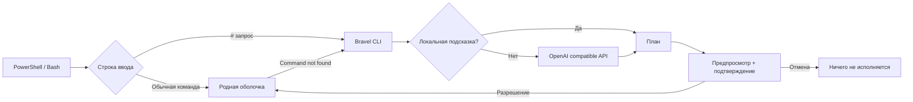

# Устройство Bravel

Bravel не заменяет shell. Python получает запрос, составляет план и спрашивает разрешение. Подключение возвращает подтверждённый скрипт в PowerShell/Bash. Обычные строки исполняет сама оболочка.

## Модули

| Модуль | Назначение |
| --- | --- |
| `config.py` | Буквальное чтение .env и проверка настроек |
| `context.py` | ОС, shell, рабочая папка и небольшой список доступных команд |
| `apps.py` | Поиск Steam и установленной CS2 в известных библиотеках |
| `planner.py` | HTTP API, проверка JSON-плана, локальное исправление опечаток |
| `executor.py` | Оценка риска, подтверждение, выполнение и остановка после ошибки |
| `ui.py` | Цветные панели и очистка управляющих символов |
| `integrations/` | Хуки PowerShell и Bash |

## Граница выполнения

Ответ модели не исполняется автоматически. Он проходит проверку формата и подтверждается через интерактивный stdin. В Bash интерфейс идёт в stderr, а подтверждённый скрипт — в stdout; до подтверждения stdout пуст. В PowerShell интерфейс отображается в консоли, а подтверждённый скрипт передаётся через созданный интеграцией временный файл, который затем удаляется. Это сохраняет цвета: PowerShell иначе окрашивает native stderr как ошибки. Невалидный ответ и отказ API прекращают процесс.

Все показанные шаги подтверждаются одним запросом; риск любого шага повышает требование подтверждения до `RUN`. Это согласование всего плана заранее, а не отдельный вопрос после каждого шага. Шаги выполняются последовательно и останавливаются при ошибке. Вывод команд остаётся в терминале и не передаётся модели автоматически.

Прямой CLI запускает дочерний shell: изменения cwd и переменных не переходят в родительскую консоль. Интеграция `ai` сохраняет cwd. Переменные PowerShell, присвоенные внутри функции, подчиняются обычным правилам scope. Bash выполняет `command_not_found_handle` в subshell: исправленная команда запускается там. В этом хуке `cd` не меняет родительский cwd; используйте `ai` для таких действий.

Контекст API содержит введённый запрос, ОС, shell, cwd и небольшой список команд. Bravel не отправляет файлы, переменные окружения или историю shell. Ключ читается из явно выбранного конфига или окружения. Рабочие `.env` не подхватываются автоматически. Перенаправления API отключены, чтобы не пересылать ключ на другой адрес.

Проверка риска эвристическая: Bravel не является песочницей. Подтверждённая команда имеет полномочия пользователя и может запустить произвольный код. Обёртки, aliases и вложенные скрипты могут скрывать опасные действия; решение принимается по показанной команде, а не по цвету риска.

## Границы первой версии

- Автоматическая помощь при неизвестном имени команды; ненулевой exit code известной команды не перехватывается. Разбор такой ошибки доступен через `bravel fix 'команда и описание ошибки'`.
- Полная интеграция: PowerShell и Bash. CMD доступен как исполнитель через `--shell cmd`; универсального безопасного перехвата ввода CMD нет.
- Специализированный поиск игры: установленный Counter-Strike в стандартном Steam и дополнительных библиотеках. Для произвольного приложения модель может предложить команду поиска; её вывод можно включить в следующий запрос.
- Однострочный `#` — запрос в интерактивном вводе; скрипты и многострочные комментарии сохраняют прежний смысл.
- Хуки заменяют обработчик неизвестных команд и Enter на время подключения. Пользовательские настройки сохраняются для отключения. Bash временно занимает Ctrl-X Ctrl-A; существующая привязка этой комбинации не восстанавливается. Ctrl-J пропускает обработку `#`.
