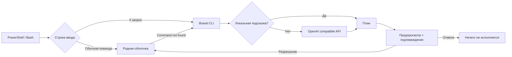

# Устройство Bravel

Bravel не заменяет shell. Python получает запрос, составляет план и спрашивает разрешение. Подключение возвращает подтверждённый скрипт в PowerShell/Bash. Обычные строки исполняет сама оболочка.

## Модули

| Модуль | Назначение |
| --- | --- |
| `config.py` | Буквальное чтение .env и проверка настроек |
| `context.py` | ОС, shell, рабочая папка и небольшой список доступных команд |
| `apps.py` | Поиск Steam и установленных игр в известных библиотеках |
| `programs.py` | Ограниченный поиск приложений: PATH, App Paths, стандартные папки, простые desktop-записи |
| `policy.py` | Локальный список команд чтения и допустимых проверок |
| `privacy.py` | Маскировка контекста, вывода и сохранённых диалогов |
| `sessions.py` | Явные именованные снимки истории без разрешений на выполнение |
| `input.py` | prompt-toolkit: редактирование, история в памяти, Tab, Alt+Enter |
| `diagnostics.py` | Локальная диагностика и добровольная проверка API |
| `planner.py` | Gemini generateContent, совместимые Chat Completions API, проверка плана |
| `setup.py` | Мастер настройки, скрытый ввод ключа, управление установленной копией |
| `install.py` | Изолированная установка, профили оболочек, обновление и удаление |
| `executor.py` | Оценка риска, подтверждение, выполнение и остановка после ошибки |
| `ui.py` | Закрытые цветные панели и очистка управляющих символов |
| `agent.py` | История, одноразовые планы, вывод команд, cwd, лимиты и отмена |
| `chat.py` | Интерактивный CLI и локальные команды диалога |
| `integrations/` | Хуки PowerShell и Bash |

## Граница выполнения

Ответ модели не исполняется автоматически. Он проходит проверку формата и подтверждается через интерактивный stdin. В Bash интерфейс идёт в stderr, а подтверждённый скрипт — в stdout; до подтверждения stdout пуст. В PowerShell интерфейс отображается в консоли, а подтверждённый скрипт передаётся через созданный интеграцией временный файл, который затем удаляется. Это сохраняет цвета: PowerShell иначе окрашивает native stderr как ошибки. Невалидный ответ и отказ API прекращают процесс.

Все показанные шаги подтверждаются одним запросом; риск любого шага повышает требование подтверждения до `RUN`. Это согласование всего плана заранее, а не отдельный вопрос после каждого шага. Шаги выполняются последовательно и останавливаются при ошибке. В режиме `ask` вывод остаётся в терминале; в `chat` и `agent` результат используется для следующего запроса.

Прямой CLI запускает дочерний shell: изменения cwd и переменных не переходят в родительскую консоль. Интеграция `ai` сохраняет cwd. Переменные PowerShell, присвоенные внутри функции, подчиняются обычным правилам scope. Bash выполняет `command_not_found_handle` в subshell: исправленная команда запускается там. В этом хуке `cd` не меняет родительский cwd; используйте `ai` для таких действий.

Контекст API содержит введённый запрос, ОС, shell, cwd и небольшой список команд. Bravel не отправляет файлы, переменные окружения или историю shell. Ключ читается из явно выбранного конфига или окружения. Рабочие `.env` не подхватываются автоматически. Перенаправления API отключены, чтобы не пересылать ключ на другой адрес.

Проверка риска эвристическая: Bravel не является песочницей. Подтверждённая команда имеет полномочия пользователя и может запустить произвольный код. Обёртки, aliases и вложенные скрипты могут скрывать опасные действия; решение принимается по показанной команде, а не по цвету риска.

## Границы первой версии

- Автоматическая помощь при неизвестном имени команды; ненулевой exit code известной команды не перехватывается. Разбор такой ошибки доступен через `bravel fix 'команда и описание ошибки'`.
- Полная интеграция: PowerShell и Bash. CMD доступен как исполнитель через `--shell cmd`; универсального безопасного перехвата ввода CMD нет.
- Специализированный поиск игры: CS2, Deep Rock Galactic и остальные установленные игры Steam по точному имени. Приложения ищутся локально в ограниченных местах. Для остальных модель может предложить подтверждаемый поиск.
- Однострочный `#` — запрос в интерактивном вводе; скрипты и многострочные комментарии сохраняют прежний смысл.
- Хуки заменяют обработчик неизвестных команд и Enter на время подключения. Пользовательские настройки сохраняются для отключения. Bash временно занимает Ctrl-X Ctrl-A; существующая привязка этой комбинации не восстанавливается. Ctrl-J пропускает обработку `#`.

## Диалоговый агент

`bravel chat` ведёт диалог, `bravel agent` решает одну задачу. Агент сохраняет последние 12 записей в памяти и последние 12 КБ вывода каждой команды. После подтверждённого выполнения он передаёт результат модели для анализа. Любой следующий план снова показывается, максимум восемь циклов. Режим ask подтверждает каждый план; preview не выполняет; read-only разрешает только весь план из локального списка чтения без повышенного риска. Вывод считается недоверенными данными в системном промпте; это не гарантирует защиту от prompt injection. Граница действий — точные показанные команды и подтверждение пользователя.

Python хранит предложенный план с одноразовым случайным идентификатором. Подменённый, отменённый или уже выполненный план отклоняется. Команды запускаются без профиля, с cwd агента и закрытым stdin. Вывод идёт во временный файл; лимит — 120 секунд или 2 МБ записанного вывода. Ошибка останавливает текущий план и передаётся модели для анализа. Ctrl+C завершает дерево процессов на Windows / группу на Linux и возвращает ввод диалога.

Cwd сохраняется для PowerShell/Bash. Для CMD доступна локальная команда `/cd`. Переменные shell не сохраняются между отдельными процессами. `/games` читает только манифесты Steam и проверяет установленные папки. `/new` очищает память, `/history` показывает её. API-ключ не отображается в `/status`.

Проект — Python CLI, без C# и графического приложения. Установщик умеет убрать старое окно версии 0.3.0 и принадлежащие ему ярлыки, сохранив движок, профили и конфиг.

## История, проверки и обновления в 0.5.0

Опциональное поле Step.check проверяется локальным списком чтения. Проверка показана вместе с основной командой; подтверждение покрывает её выполнение и одну повторную попытку. Наблюдение файла или процесса записывается в результат. Существовавший до запуска процесс не доказывает новое окно. Проверки через ask выполняются в дочернем агенте; интеграции исполняют подтверждённый скрипт в родительском shell и не выполняют отдельные проверки.

Маскировка применяется перед сериализацией пользовательского payload, не к заголовкам авторизации API. Текущий API-ключ также маскируется в результатах и сохранённых диалогах. Распознавание произвольных секретов не гарантируется. Именованные истории сохраняются явно, содержат только данные, а не pending/plan_id. Загрузка сбрасывает разрешения, помечает историю как прошлую и сохраняет текущую оболочку машины.

При обновлении новый установщик копирует прежний venv, hooks, установщик и манифест в собственный rollback-снимок. Откат выполняет отдельный helper после выхода CLI, возвращает окружение на исходный путь (важно для launcher/shebang), восстанавливает манифест и расходует снимок. API-конфиг и пользовательские диалоги находятся вне каталога установки. До удаления/перемещения проверяются принадлежность снимка и абсолютные пути внутри управляемого корня.
