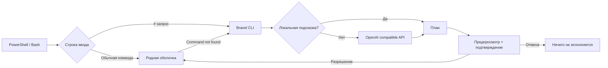

# Устройство Bravel

Bravel не заменяет shell. Python получает запрос, составляет план и спрашивает разрешение. Подключение возвращает подтверждённый скрипт в PowerShell/Bash. Обычные строки исполняет сама оболочка.

## Модули

| Модуль | Назначение |
| --- | --- |
| `config.py` | Буквальное чтение .env и проверка настроек |
| `context.py` | ОС, shell, рабочая папка и небольшой список доступных команд |
| `apps.py` | Поиск Steam и установленной CS2 в известных библиотеках |
| `planner.py` | Gemini generateContent, совместимые Chat Completions API, проверка плана |
| `setup.py` | Мастер настройки, скрытый ввод ключа, управление установленной копией |
| `install.py` | Изолированная установка, профили оболочек, обновление и удаление |
| `executor.py` | Оценка риска, подтверждение, выполнение и остановка после ошибки |
| `ui.py` | Цветные панели и очистка управляющих символов |
| `integrations/` | Хуки PowerShell и Bash |
| `agent.py` | История диалога, одноразовые планы, вывод команд, cwd и отмена |
| `bridge.py` | Локальный JSON-протокол по stdin/stdout для интерфейса |
| `desktop/Bravel.Desktop` | C# / Avalonia: окно, настройки и подтверждение действий |

## Граница выполнения

Ответ модели не исполняется автоматически. Он проходит проверку формата и подтверждается через интерактивный stdin. В Bash интерфейс идёт в stderr, а подтверждённый скрипт — в stdout; до подтверждения stdout пуст. В PowerShell интерфейс отображается в консоли, а подтверждённый скрипт передаётся через созданный интеграцией временный файл, который затем удаляется. Это сохраняет цвета: PowerShell иначе окрашивает native stderr как ошибки. Невалидный ответ и отказ API прекращают процесс.

Все показанные шаги подтверждаются одним запросом; риск любого шага повышает требование подтверждения до `RUN`. Это согласование всего плана заранее, а не отдельный вопрос после каждого шага. Шаги выполняются последовательно и останавливаются при ошибке. В режиме `ask` вывод остаётся в терминале; в режиме `agent` и окне результат используется для следующего запроса.

## Окно и диалоговый агент

C# запускает выбранный Python как дочерний процесс `python -u -m bravel.bridge`. Обмен — JSON-строки по приватным pipe, без HTTP-сервера и открытого TCP-порта. Настройки и API-запросы остаются в Python. C# получает признак наличия ключа, но не его значение; новый ключ передаётся только при сохранении настроек. stdout движка содержит только сообщения протокола. Отмену можно отправить во время запроса; остальные действия сериализованы.

Python хранит показанный план и выдаёт случайный `plan_id`. Выполнение принимает этот идентификатор и подтверждение `approve` либо `RUN`, а не текст новых команд от окна. Подменённый, отменённый, устаревший или уже выполненный план отклоняется. Это локальный протокол доверенного интерфейса, а не API для удалённых клиентов. План не исполняется при составлении; риск повторно вычисляется на стороне Python.

Диалог содержит последние 12 записей в памяти. Команда запускается без профиля, с cwd агента и закрытым stdin. Вывод записывается во временный файл, сохраняются последние 12 КБ; лимит команды — 120 секунд или 2 МБ записанного вывода. Весь план останавливается на ошибке. «Остановить» завершает дерево процессов на Windows / группу на Linux. Смена папки PowerShell/Bash сохраняется в агенте; переменные shell между отдельными процессами не сохраняются. CMD также не сохраняет cwd между командами. Отменённый API-запрос может закончиться только после ответа/таймаута, но его план не становится доступен для выполнения.

В окне продолжение после результата запускается отдельной кнопкой. В `bravel agent` анализ идёт после подтверждённого выполнения. Каждый новый план требует нового разрешения, максимум восемь циклов. Вывод считается недоверенными данными в системном промпте. Это не гарантирует защиту от prompt injection; граница действий остаётся показанный план и подтверждение пользователя.

Интерфейс распространяется как самостоятельная .NET-сборка для x64 Windows/Linux. Python устанавливается отдельно тем же `install.py --desktop`; при обновлении сохраняется наличие интерфейса, при удалении удаляются приложение и только принадлежащие ему ярлыки. Стеклянное оформление использует прозрачные градиенты и AcrylicBlur при поддержке платформой, с цветным фоном для читаемости.

Прямой CLI запускает дочерний shell: изменения cwd и переменных не переходят в родительскую консоль. Интеграция `ai` сохраняет cwd. Переменные PowerShell, присвоенные внутри функции, подчиняются обычным правилам scope. Bash выполняет `command_not_found_handle` в subshell: исправленная команда запускается там. В этом хуке `cd` не меняет родительский cwd; используйте `ai` для таких действий.

Контекст API содержит введённый запрос, ОС, shell, cwd и небольшой список команд. Bravel не отправляет файлы, переменные окружения или историю shell. Ключ читается из явно выбранного конфига или окружения. Рабочие `.env` не подхватываются автоматически. Перенаправления API отключены, чтобы не пересылать ключ на другой адрес.

Проверка риска эвристическая: Bravel не является песочницей. Подтверждённая команда имеет полномочия пользователя и может запустить произвольный код. Обёртки, aliases и вложенные скрипты могут скрывать опасные действия; решение принимается по показанной команде, а не по цвету риска.

## Границы первой версии

- Автоматическая помощь при неизвестном имени команды; ненулевой exit code известной команды не перехватывается. Разбор такой ошибки доступен через `bravel fix 'команда и описание ошибки'`.
- Полная интеграция: PowerShell и Bash. CMD доступен как исполнитель через `--shell cmd`; универсального безопасного перехвата ввода CMD нет.
- Локально проверяются CS2, Deep Rock Galactic и другие игры Steam по точному названию манифеста. Для произвольного приложения модель может предложить поиск, а агент — использовать его результат в следующем плане.
- Действия на компьютере выполняются командами. Управления мышью, распознавания экрана, внешних MCP-серверов и доступа к файлам без команды в этой версии нет.
- Однострочный `#` — запрос в интерактивном вводе; скрипты и многострочные комментарии сохраняют прежний смысл.
- Хуки заменяют обработчик неизвестных команд и Enter на время подключения. Пользовательские настройки сохраняются для отключения. Bash временно занимает Ctrl-X Ctrl-A; существующая привязка этой комбинации не восстанавливается. Ctrl-J пропускает обработку `#`.
